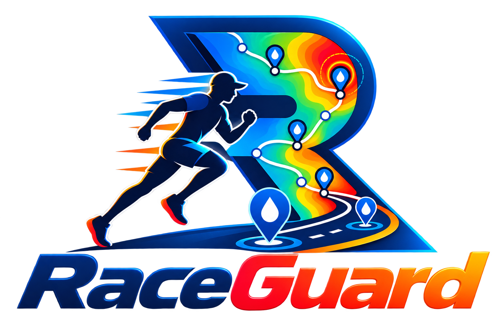

<p align="center">
  
</p>

<h1 align="center">RaceGuard</h1>

<p align="center">
  <strong>Put race relief where runners face the most heat.</strong>
</p>

<p align="center">
  RaceGuard combines FortyGuard's hyperlocal temperature data with constrained optimization to reposition existing relief stations and reduce the worst uninterrupted relative heat exposure along a race course.
</p>

<p align="center">
  <a href="https://raceguard.streamlit.app">Live Demo</a>
  ·
  <a href="#prepared-case-studies">Case Studies</a>
  ·
  <a href="#run-locally">Run Locally</a>
</p>

## Hackathon Track

**Track 1 — Resilient Cities & Infrastructure**

RaceGuard treats relief stations as heat-resilience infrastructure. It helps race organizers position existing water, medical, restroom, and cooling resources according to spatial temperature variation rather than distance alone.

## The Problem

Race relief stations are commonly planned around fixed distance intervals, logistics, and historical convention. Those factors matter, but evenly spaced stations do not necessarily provide equal protection when temperatures vary along a course.

A runner may therefore experience a long, relatively hot section without relief even when the overall station spacing appears reasonable.

RaceGuard asks a more useful operational question:

> Given an existing number of stations and realistic relocation limits, where should those stations be placed to reduce the worst uninterrupted relative heat burden?

## What RaceGuard Does

RaceGuard allows an organizer to:

1. Upload an ordered race course as GPX or GeoJSON.
2. Upload existing relief stations by course distance or coordinates.
3. Select historical conditions or a forecast within the next 12 hours.
4. Define operational constraints:
   - Minimum distance between stations
   - Maximum distance between stations
   - Maximum movement allowed per station
5. Preview the exact buffered area sent to FortyGuard.
6. Request hyperlocal temperature data at 100-metre resolution.
7. Compare the current station plan with an optimized feasible plan.
8. Export the recommended station positions as CSV.

The optimizer keeps the number of stations fixed. RaceGuard recommends relocation, not unlimited new infrastructure.

## Prepared Case Studies

The live application includes two prepared examples that require no API key or credits.

| Race | Baseline | Constraints | Measured result |
|---|---|---|---|
| AJC Peachtree Road Race | Five existing stations | 1,000 m minimum gap, 2,000 m maximum gap, 500 m maximum relocation | **18.2% reduction** in worst uninterrupted relative heat burden |
| BOLDERBoulder | Four baseline stations at miles 2, 3, 4, and 5 | 1,000 m minimum gap, 500 m maximum relocation | **24.0% reduction** in worst uninterrupted relative heat burden |

BOLDERBoulder's route-distance axis is calibrated to its official 10,000-metre distance before optimization.

These percentages are route-relative planning results for the prepared temperature snapshots. They are not medical-risk reductions.

## How FortyGuard Is Used

FortyGuard is central to RaceGuard's analysis.

RaceGuard:

1. Creates a 200-metre buffer around the uploaded course.
2. Converts that area into the polygon request format used by FortyGuard.
3. Requests either:
   - A historical hourly temperature snapshot, or
   - A forecast snapshot within the next 12 hours
4. Uses a heatmap granularity of 100 metres.
5. Matches evenly spaced course samples to the returned heatmap tiles.
6. Reads each tile's `average_temperature`.
7. Builds a distance-based temperature profile for the route.
8. Converts spatial temperature variation into a cumulative relative heat-burden profile used by the optimizer.

Heatmap responses are cached by request area, time, analysis type, and resolution. A valid cache can be reused without spending additional API credits.

The API key entered through the application is kept only in the active Streamlit session and is not written to the cache.

## Optimization Approach

RaceGuard evaluates the accumulated route-relative temperature burden between consecutive relief opportunities, including:

- Start to first station
- Each station-to-station segment
- Final station to finish

The objective is to minimize the largest segment burden while respecting the organizer's operational constraints.

This is a minimax optimization problem: improving the average segment is insufficient if one section of the course still leaves runners with substantially worse uninterrupted exposure.

The output includes:

- Current and proposed station positions
- Movement distance and direction for each station
- Current and optimized segment comparisons
- Worst-segment reduction
- Maximum and combined relocation distance
- Downloadable recommended station coordinates

## Application Workflow

```text
Course upload
    ↓
Station-plan validation
    ↓
Race settings and operational constraints
    ↓
Buffered FortyGuard request preview
    ↓
Route temperature profile
    ↓
Constrained station optimization
    ↓
Map, metrics, technical comparison, and CSV export
```

## Project Structure

```text
RaceGuard/
├── app.py                    # Streamlit application
├── course_loader.py          # GPX/GeoJSON loading and route validation
├── station_loader.py         # Station CSV validation and course positioning
├── heatmap_request.py        # AOI creation, API requests, and caching
├── temperature_profile.py    # Route sampling and heat-profile construction
├── station_optimizer.py      # Constrained station optimization
├── race_analysis.py          # Baseline comparison and result summaries
├── map_visualization.py      # Course and recommendation maps
├── fortyguard/               # FortyGuard Python client
├── assets/                   # RaceGuard branding
├── data/                     # Prepared courses, stations, and API responses
├── notebooks/                # Early validation and exploratory work
└── requirements.txt
```

## Input Formats

### Course

RaceGuard accepts:

- `.gpx`
- `.geojson`
- `.json`

The file must contain an ordered route that can be converted into a single `LineString`.

### Relief Stations

Station CSV files must include `station_id` and one of:

- `distance_km`, or
- `latitude` and `longitude`

Optional facility columns include:

- `has_water`
- `has_restrooms`
- `has_first_aid`

A downloadable CSV template is available inside the application.

## Run Locally

RaceGuard was developed with Python 3.10.

```bash
git clone https://github.com/Maab-Hu/RaceGuard.git
cd RaceGuard

python -m venv .venv
```

Activate the environment:

```bash
# Windows Git Bash
source .venv/Scripts/activate

# macOS/Linux
source .venv/bin/activate
```

Install the dependencies and start the app:

```bash
python -m pip install -r requirements.txt
streamlit run app.py
```

The prepared examples work without an API key. A FortyGuard API key is required only when requesting new temperature data through the custom-race workflow.

## Responsible Use and Limitations

RaceGuard is a planning and decision-support prototype.

- Its heat-burden metric measures route-relative spatial temperature variation.
- It is not a physiological model or medical-risk prediction.
- It does not replace meteorological warnings, medical guidance, emergency planning, or on-site professional judgment.
- Recommendations remain subject to road access, permits, staffing, crowd control, utilities, and race-specific logistics.
- Temperature quality and coverage depend on the FortyGuard response for the selected location and time.
- Prepared case-study results should not be generalized to other races or weather conditions.

## Built for FortyGuard Hackathon '26

RaceGuard was developed for the **FortyGuard Hackathon '26** to demonstrate how hyperlocal temperature intelligence can inform practical, measurable heat-resilience decisions.

AI-assisted development tools were used for guided architecture discussion, debugging, interface refinement, and documentation. The application logic, validation workflow, optimization design, and case-study analysis were implemented and tested as part of the project.